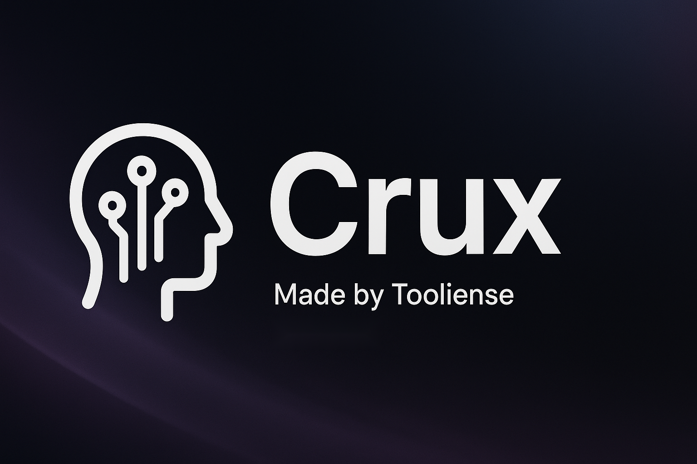

<div align="center">

# 🚀 CRUX

<p><em>The State-of-the-Art Intelligence</em></p>


<p align="center">
  <a href="https://tooliense.com">
    🌐 <strong>Website</strong>
  </a> •
  <a href="https://discord.gg/mP5YVp5gwK">
    💬 <strong>Join Discord</strong>
  </a>
</p>

---

<h3>🧠 Breakthrough AI Research • 🎯 Mathematical Discovery • 🔬 Autonomous Problem Solving</h3>

<p align="center">
<a href="2025_USAMO_p6.pdf">

</a>
<a href="2025_USAMO_p6.pdf">

</a>
<a href="TTRL-paper.pdf">

</a>
<a href="TTRL-paper.pdf">

</a>
</p>

<p align="center">
<a href="https://opensource.org/licenses/MIT">

</a>
<a href="https://www.python.org/downloads/">

</a>
<a href="https://openai.com/">

</a>
<a href="https://deepseek.com/">

</a>
</p>

</div>

<br>

> **🎓 Breakthrough Achievement**: Revolutionary AI system demonstrating autonomous mathematical research and complex problem solving through hierarchical multi-agent orchestration.

> **⚡ Current Status**: Open-sourced complete implementation including core Self-Evolve mechanism and production-ready web application.

<div align="center">

### 🌟 **Core Innovation: IC-RL (In-Context Reinforcement Learning)**

**Prompt ≙ Policy Parameters | Feedback ≙ Reward**

_We optimize the context itself, not the model weights._

</div>

---

## 🏆 Key Achievements

### 🎯 2025 USAMO Problem 6 Complete Solution

- **9,000+ lines** of internal reasoning
- **1+ hour** of continuous problem-solving
- **Complete mathematical proof** with rigorous methodology

📄 **[View Solution](./2025USAMO/2025_USAMO_p6.pdf)** - The final output showcasing Crux's unique approach to complex mathematical problems.

### 🔬 Independent TTRL Hypothesis Verification

**Starting from only the hypothesis**, Crux autonomously derived:

- ✅ **9 systematic lemmas** with complete mathematical rigor
- ✅ **Full convergence proofs** for the theoretical framework
- ✅ **δ-bookkeeping methodology** for practical implementation
- ✅ **Research-grade theoretical foundations** matching peer-reviewed standards
- 📄 **[View Research](./arXiv/TTRL-paper.pdf)**

### 🏗️ Enhanced Multi-Layer Agent Architecture

- **Hierarchical orchestration** inspired by graduate school research structures
- **Recursive depth capabilities** for arbitrarily complex problems
- **Dynamic specialist allocation** based on problem complexity
- **Proven scaling behavior** similar to deep neural networks
  📄 **[View Research](./arXiv/TTRL-paper.pdf)** - Complete independent mathematical derivation and analysis.

> **Paradigm Shift**: Crux doesn't just reproduce existing work—it conducts **original mathematical discovery** through autonomous reasoning.

## Core Capabilities

| Feature                       | Description                                           |
| ----------------------------- | ----------------------------------------------------- |
| 🧮 **Mathematical Reasoning** | Deep mathematical understanding with proof generation |
| 🔍 **Problem Analysis**       | Systematic breakdown of complex mathematical problems |
| 📊 **Theoretical Framework**  | Independent development of mathematical theories      |
| 🎯 **USAMO-Level Solutions**  | Solving competition-grade mathematical problems       |
| 🔬 **Research Methodology**   | Autonomous mathematical research and discovery        |

## Key Research Areas

### Mathematics & Problem Solving

- Competition mathematics (USAMO, IMO level)
- Abstract algebra and number theory
- Combinatorics and graph theory
- Mathematical analysis and proofs

### Theoretical AI Research

- Test-Time Reinforcement Learning (TTRL)
- Mathematical reasoning architectures
- Autonomous theorem proving
- AI-driven mathematical discovery

### Research Methodology

- Independent hypothesis verification
- Rigorous proof construction
- Systematic lemma development
- Mathematical framework derivation

## Technical Specifications

**Problem Solving Capability:**

- **Input**: Mathematical problems, hypotheses, research questions
- **Processing**: 9,000+ lines of internal reasoning
- **Output**: Complete solutions with rigorous proofs
- **Time**: 1+ hours for complex problems

**Research Methodology:**

- Systematic lemma development
- Convergence proof construction
- Independent framework derivation
- Peer-reviewed quality standards

## Research Impact


## Contributing to Research

We welcome contributions to advancing AI-driven mathematical research! Feel free to:

- 🔬 Propose new mathematical challenges
- 📊 Share research insights and methodologies
- 🧮 Contribute to theoretical frameworks
- 📚 Help document research findings

### Research Timeline

- **Current**: Advanced mathematical reasoning and problem solving
- **Q1 2025**: Expanded theoretical framework development
- **Q2 2025**: Multi-domain mathematical applications
- **Future**: Revolutionary advances in AI-driven mathematical discovery

## About Tooliense

**Our mission is to push the boundaries of AI-driven research and mathematical discovery.** Crux represents a breakthrough in autonomous mathematical reasoning. Visit [tooliense.com](https://tooliense.com) to learn more about our research initiatives.

---

## 📁 Project Structure

### [🧠 Self-Evolve Core](./self-evolve/)

The heart of Crux - implementing the IC-RL algorithm with enhanced multi-agent hierarchical architecture.

**Key Features:**

- Basic Self-Evolve mechanism (Generator → Evaluator → Refiner)
- Enhanced Professor-Specialist architecture
- Recursive deep agent hierarchies
- Dynamic function calling for optimal team composition

[**→ Read Full Documentation**](./self-evolve/ReadMe.md)

### [🌐 Crux Agent Web Application](./crux-agent/)

Production-ready FastAPI + Next.js application for experiencing Crux capabilities.

**Key Features:**

- RESTful API with async processing (FastAPI + Celery)
- Modern React frontend with real-time updates
- Multi-provider LLM support (OpenAI, OpenRouter, DeepSeek)
- Supabase integration for authentication and persistence

[**→ Read Full Documentation**](./crux-agent/README.md)

---

## 🚀 Quick Start

### Option 1: Run Core Self-Evolve Engine

```bash
# Clone and setup
git clone https://github.com/your-org/crux.git
cd crux/self-evolve

# Install dependencies
pip install -r requirements.txt

# Set API keys
export OPENAI_API_KEY="your-key-here"

# Run basic example
python -m self-evolve.exampels.example_usage.py

# Run enhanced Professor-Graduate architecture
python -m self-evolve.examples.professor_graduate_example
```

### Option 2: Run Full Web Application

```bash
# Navigate to agent directory
cd crux/crux-agent

# Setup backend
pip install -r requirements.txt
cp .env.example .env
# Edit .env with your API keys

# Start services
redis-server  # Terminal 1
python worker.py  # Terminal 2
uvicorn app.main:app --reload  # Terminal 3

# Setup frontend (new terminal)
cd crux-mvp
pnpm install
pnpm dev
```

Visit `http://localhost:3000` to access the web interface.

---

## 💡 Technical Innovation

### IC-RL: A New Paradigm

- Treats **prompts as trainable policy parameters**
- Uses **natural-language feedback as reward signals**
- Achieves optimization through **context refinement**, not weight updates

### Hierarchical Agent Architecture

```
🎓 Professor Agent
    ├── 🔬 Math Specialist → [Sub-specialists...]
    ├── 🔬 Logic Specialist → [Sub-specialists...]
    └── 🔬 Domain Specialist → [Sub-specialists...]
```

Each specialist can recursively become a professor, creating fractal-like intelligence hierarchies.

### Proven Scaling Behavior

- **Depth-1**: Single agent for simple tasks
- **Depth-2**: Professor + 3-4 specialists for complex reasoning
- **Depth-3+**: Recursive hierarchies for research-grade problems

---

## 📈 Performance Insights

| Metric                 | Basic Self-Evolve | Enhanced Architecture |
| ---------------------- | ----------------- | --------------------- |
| **Problem Complexity** | Medium            | Ultra-High            |
| **Reasoning Depth**    | ~100 lines        | 9,000+ lines          |
| **Success Rate**       | Good              | Exceptional           |
| **Scaling Ability**    | Limited           | Unlimited             |

---

## 🤝 Contributing

We welcome contributions! Areas of interest:

- Automated specialist discovery algorithms
- Cross-domain transfer learning
- Resource optimization for dynamic teams
- Integration with ML frameworks

See [Contributing Guidelines](CONTRIBUTING.md) for details.

---

## 📚 Citation

```bibtex
@misc{tooliense2025crux,
  title  = {CRUX: Autonomous Mathematical Research through Hierarchical Multi-Agent Orchestration},
  author = {Tooliense Team},
  year   = {2025},
  note   = {IC-RL Implementation with Self-Evolve Mechanism},
  url    = {https://github.com/tooliense/crux}
}
```

---

## 📄 License

MIT License. Please respect the terms of your model provider (OpenAI, DeepSeek, etc.).

---

<div align="center">

### ✨ _"The LLM already knows; we orchestrate the right specialists with the right questions through dynamic intelligence hierarchies."_ ✨

**Powered by Tooliense Crux Agent Architecture**

[🌐 Website](https://tooliense.com) • [📚 Documentation](./self-evolve/ReadMe.md) • [🚀 Get Started](#-quick-start)

</div>
