# 🧠 IC-RL: In-Context Reinforcement Learning with Natural‑Language Rewards


<div align="center">

<p align="center">
<a href="https://opensource.org/licenses/MIT">

</a>
<a href="https://www.python.org/downloads/">

</a>
<a href="https://openai.com/">

</a>
<a href="https://deepseek.com/">

</a>
</p>

### **Prompt ≙ Policy Parameters | Feedback ≙ Reward**
*We optimize the context itself, not the model weights.*

*Powered by **Tooliense Crux** Agent Architecture*

</div>

---

## 🎯 Overview

**IC‑RL** is a meta‑learning framework that treats the **prompt (context)** as a trainable policy and leverages **natural‑language feedback (NL reward)** as the supervisory signal, while the underlying **large language model (agent)** remains frozen. By re‑interpreting a multi‑turn dialogue as an **RL loop**, the method extracts solutions already latent in the LLM through pure prompt search.

This implementation is based on the **Crux** agent system developed by **Tooliense**, featuring an enhanced architecture that overcomes the limitations of traditional Self-Evolve mechanisms through hierarchical agent orchestration.

---

## 💡 Core Assumptions & Intuitions

<table>
<tr>
<th width="30%">🔑 Principle</th>
<th width="70%">📝 Description</th>
</tr>
<tr>
<td><strong>G1</strong><br/>Expressive Prompt Space</td>
<td>A sufficiently large LLM will output the desired answer given some prompt θ* ∈ 𝒫, so we train prompts—not weights.</td>
</tr>
<tr>
<td><strong>G2</strong><br/>Self‑Diagnostics</td>
<td>Even if one‑shot answers are imperfect, LLMs can accurately articulate their own errors in natural language.</td>
</tr>
<tr>
<td><strong>G3</strong><br/>Rich NL Reward</td>
<td>Natural‑language feedback carries orders of magnitude more information than a scalar reward—crucial for hard reasoning tasks.</td>
</tr>
<tr>
<td><strong>G4</strong><br/>Context‑Search Exploration</td>
<td>The agent need not become smarter than the base model; it only needs an exploration policy to discover θ*.</td>
</tr>
<tr>
<td><strong>G5</strong><br/>Hierarchical Independence</td>
<td>Independent agents in a hierarchical structure can explore state spaces more efficiently than single-layer mechanisms.</td>
</tr>
</table>

---

## 📐 Problem Formulation

<div align="center">

</div>

Where:
- **Evaluator** generates natural‑language feedback φ
- **Refiner (π_φ)** converts φ into a prompt update Δθ
- **r(·)** is simply the raw natural‑language feedback φ (no scalar projection by default)

---

## 🔄 Self-Evolve Mechanism

By the concept of IC-RL, we developed the **Self-Evolve mechanism** - a workflow that implements the core IC-RL loop:

```python
1. Generate    response using current prompt θₜ
2. Evaluate    response quality using prepared QA sets
3. Feedback    natural-language evaluation sign
4. Refine      initial prompt using feedback optimization
5. Evolve      repeat mechanism for continuous improvement
```

### Key Principles of Self-Evolve

The Self-Evolve mechanism works effectively when the three components (Generator, Evaluator, Refiner) operate **independently** (based on Idea 3). This independence allows for:
- Unbiased evaluation of generated responses
- Objective refinement based purely on feedback signals
- Continuous evolution through iterative improvement cycles

---

## 🏗️ Enhanced Crux Architecture

### Limitations of Basic Self-Evolve

While the Self-Evolve mechanism showed promising results, we discovered it had limitations when facing harder, more complex tasks. The single-layer approach would get stuck and plateau, unable to break through challenging problem domains.

### Graduate School Inspired Architecture

To overcome these limitations, we developed an **enhanced architecture inspired by graduate school research structures**:

```
                    🎓 Professor Agent
                         │
           ┌─────────────┼─────────────┐
           │             │             │
      🔬 Specialist   🔬 Specialist   🔬 Specialist
         Agent          Agent          Agent
           │             │             │
     [Function Call] [Function Call] [Function Call]
```

#### The Professor-Specialist Recursive Model

- **Professor Agent**: Acts as the research leader, orchestrating and controlling specialist agents through function calling
- **Specialist Agents**: Independent experts that can also act as **sub-professors**, managing their own team of specialists
- **Recursive Hierarchy**: Each specialist can recursively become a professor for lower-level specialists, creating deep hierarchical structures
- **Function Calling Interface**: Enables any agent at any level to utilize sub-agents as sophisticated tools

This mirrors how a graduate school professor leads research by directing specialists in their respective fields, and those specialists may lead their own research groups with sub-specialists, creating a natural recursive hierarchy.

### Neural Network Analogy

The enhanced architecture draws parallels to neural networks:

```
Traditional NN Layer    →    Single Self-Evolve Mechanism
Deep NN Architecture    →    Multi-Layer Agent Architecture
```

**Key Insight**: Just as deeper neural networks can solve more complex problems, deeper layers of agents in our system demonstrate enhanced capability for complex problem-solving.

#### The Transformer Connection

We've observed that **Transformers are essentially agent systems based on Neural Networks, not just language models**. The same architectural principles that make deep Transformers powerful apply to our multi-layer agent systems:

- **Attention Mechanisms** → **Agent Communication Patterns**
- **Layer Depth** → **Hierarchical Agent Depth**
- **Parallel Processing** → **Concurrent Agent Operations**

### 🏗️ Recursive Deep Architecture

The key insight is that **any Specialist can become a Professor** for its own sub-specialists, creating a fractal-like recursive structure:

#### Depth-1: Basic Self-Evolve
```
Input → [Generator → Evaluator → Refiner] → Output
```

#### Depth-2: Professor-Specialist
```
Input → [Professor] → [Specialist₁, Specialist₂, Specialist₃] → Integration → Output
```

#### Depth-3: Recursive Specialists
```
Input → [Professor] → [Specialist₁-Prof, Specialist₂-Prof, Specialist₃-Prof] → Integration → Output
                           │                │                │
                    [Sub-Spec₁₁,      [Sub-Spec₂₁,      [Sub-Spec₃₁,
                     Sub-Spec₁₂,       Sub-Spec₂₂,       Sub-Spec₃₂,
                     Sub-Spec₁₃]       Sub-Spec₂₃]       Sub-Spec₃₃]
```

#### Depth-N: Infinite Recursive Depth

```mermaid
---
config:
  layout: dagre
---
flowchart TD
    Input[["🎯 Complex Problem"]]
    
    subgraph L0["Level 0 - Root Professor"]
        Prof0["🎓 Root Professor"]
    end
    
    subgraph L1["Level 1 - Department Heads"]
        Prof1["🎓 Math Prof-Specialist"]
        Prof2["🎓 Logic Prof-Specialist"] 
        Prof3["🎓 Creative Prof-Specialist"]
    end
    
    subgraph L2["Level 2 - Sub-Departments"]
        Prof11["🎓 Algebra Prof-Spec"]
        Prof12["🎓 Geometry Prof-Spec"]
        Prof21["🎓 Formal Prof-Spec"]
        Prof22["🎓 Reasoning Prof-Spec"]
        Prof31["🎓 Writing Prof-Spec"]
        Prof32["🎓 Design Prof-Spec"]
    end
    
    subgraph L3["Level 3 - Individual Specialists"]
        Spec111["🔬 Linear Algebra"]
        Spec112["🔬 Abstract Algebra"]
        Spec121["🔬 Euclidean Geo"]
        Spec122["🔬 Topology"]
        Spec211["🔬 Propositional"]
        Spec212["🔬 Predicate Logic"]
        Spec221["🔬 Deductive"]
        Spec222["🔬 Inductive"]
        Spec311["🔬 Technical Writing"]
        Spec312["🔬 Creative Writing"]
        Spec321["🔬 UI Design"]
        Spec322["🔬 System Design"]
    end
    
    subgraph L4["Level 4 - Tool Specialists"]
        Tool1["⚙️ Calculation"]
        Tool2["⚙️ Verification"]
        Tool3["⚙️ Formatting"]
        Tool4["⚙️ Research"]
    end
    
    Integration[["🔗 Recursive Integration"]]
    Output[["✅ Deep Solution"]]
    
    %% Main flow
    Input --> Prof0
    Prof0 --> Prof1 & Prof2 & Prof3
    
    Prof1 --> Prof11 & Prof12
    Prof2 --> Prof21 & Prof22  
    Prof3 --> Prof31 & Prof32
    
    Prof11 --> Spec111 & Spec112
    Prof12 --> Spec121 & Spec122
    Prof21 --> Spec211 & Spec212
    Prof22 --> Spec221 & Spec222
    Prof31 --> Spec311 & Spec312
    Prof32 --> Spec321 & Spec322
    
    Spec111 & Spec112 & Spec121 & Spec122 --> Tool1 & Tool2
    Spec211 & Spec212 & Spec221 & Spec222 --> Tool2 & Tool4
    Spec311 & Spec312 & Spec321 & Spec322 --> Tool3 & Tool4
    
    %% Integration flow
    Tool1 & Tool2 & Tool3 & Tool4 --> Integration
    Spec111 & Spec112 & Spec121 & Spec122 & Spec211 & Spec212 & Spec221 & Spec222 & Spec311 & Spec312 & Spec321 & Spec322 --> Integration
    Prof11 & Prof12 & Prof21 & Prof22 & Prof31 & Prof32 --> Integration
    Prof1 & Prof2 & Prof3 --> Integration
    Prof0 --> Integration
    Integration --> Output
    
    classDef prof fill:#FFD700,stroke:#FF8C00,stroke-width:3px,color:#000
    classDef spec fill:#98FB98,stroke:#228B22,stroke-width:2px,color:#000
    classDef tool fill:#FFB6C1,stroke:#DC143C,stroke-width:2px,color:#000
    classDef integration fill:#DDA0DD,stroke:#9370DB,stroke-width:3px,color:#000
    
    class Prof0,Prof1,Prof2,Prof3,Prof11,Prof12,Prof21,Prof22,Prof31,Prof32 prof
    class Spec111,Spec112,Spec121,Spec122,Spec211,Spec212,Spec221,Spec222,Spec311,Spec312,Spec321,Spec322 spec
    class Tool1,Tool2,Tool3,Tool4 tool
    class Integration integration
```


### 🔄 Optimized Self-Evolve Loop Configuration

Through extensive testing, we discovered optimal Self-Evolve loop configurations for each architecture depth:

<table>
<tr>
<th width="20%">🏗️ Architecture</th>
<th width="25%">🔄 Loop Configuration</th>
<th width="20%">📊 Dynamic Calls</th>
<th width="35%">💡 Reasoning</th>
</tr>
<tr>
<td><strong>Basic Mode</strong><br/>(Depth-1)</td>
<td>4 loops total</td>
<td>Fixed: 1 agent</td>
<td>Single agent needs multiple iterations to converge</td>
</tr>
<tr>
<td><strong>Enhanced Mode</strong><br/>(Depth-2)</td>
<td>Specialists: 6 loops<br/>Professor: 2-3 loops</td>
<td>Avg: 3-4 specialists<br/>(Dynamic function calls)</td>
<td>Specialists need deep refinement, Professor adapts team size</td>
</tr>
<tr>
<td><strong>Deep Mode</strong><br/>(Depth-3+)</td>
<td>Each level: 4-8 loops<br/>Higher levels: 2-4 loops</td>
<td>Avg: 3-4 per level<br/>(Recursive dynamic calls)</td>
<td>Each professor-specialist adapts sub-team size based on problem complexity</td>
</tr>
</table>

### 📈 Dynamic API Call Growth Analysis

Unlike static architectures, our system uses **dynamic function calling** where each Professor-level agent determines the optimal number of specialists based on problem complexity. Testing on **IMO/USAMO-level mathematical problems** showed an average of **3-4 specialist calls per professor**.

#### Dynamic Call Count Formula
```python
def calculate_dynamic_api_calls(depth, avg_specialists=3.5, base_loops=4):
    """
    Calculate API calls with dynamic specialist allocation
    Based on IMO/USAMO complexity testing
    """
    total_calls = 0
    
    for level in range(depth):
        if level == 0:  # Root professor
            agents_at_level = 1
            loops = 3  # Professor coordination loops
        else:  # Specialist levels
            agents_at_level = int(avg_specialists ** level)
            loops = base_loops + (2 if level == depth-1 else 0)  # Leaf specialists get more loops
        
        level_calls = agents_at_level * loops * 3  # 3 components per agent
        total_calls += level_calls
    
    return total_calls
```
### 🧮 Mathematical Growth Pattern

#### Dynamic API Call Growth Function
```python
def calculate_dynamic_api_calls(depth, avg_specialists=3.5, base_loops=4):
    """
    Calculate API calls with dynamic specialist allocation
    Based on IMO/USAMO complexity testing showing 3-4 avg specialist calls
    """
    total_calls = 0
    
    for level in range(depth):
        if level == 0:  # Root professor
            agents_at_level = 1
            loops = 3  # Professor coordination loops
        else:  # Specialist levels (dynamically allocated)
            agents_at_level = round(avg_specialists ** level)
            loops = base_loops + (2 if level == depth-1 else 0)  # Leaf specialists get more loops
        
        level_calls = agents_at_level * loops * 3  # 3 components per agent
        total_calls += level_calls
        
        print(f"Level {level}: {agents_at_level} agents × {loops} loops × 3 = {level_calls} calls")
    
    return total_calls

# Example outputs with dynamic allocation (3.5 avg):
# Depth-1: 12 calls
# Depth-2: 72 calls  (6x increase)
# Depth-3: 231 calls (3.2x increase) 
# Depth-4: 774 calls (3.4x increase)
```

#### Scaling Behavior with Dynamic Function Calls
The growth pattern is more moderate than static 3^N due to:
- **Adaptive specialist allocation** based on problem complexity
- **Professor agents intelligently determine** optimal team size
- **IMO/USAMO testing** showed consistent 3-4 specialist pattern
- **Diminishing returns** as deeper levels require fewer additional specialists

### 🎯 Scaling Strategy by Recursive Depth

<table>
<tr>
<th width="20%">🎚️ Depth Level</th>
<th width="20%">🏗️ Structure</th>
<th width="20%">🤖 Total Agents</th>
<th width="40%">🎯 Problem Types</th>
</tr>
<tr>
<td><strong>Depth-1</strong></td>
<td>Single Agent</td>
<td>1</td>
<td>Simple Q&A, Basic calculations</td>
</tr>
<tr>
<td><strong>Depth-2</strong></td>
<td>1 Prof + 3 Specs</td>
<td>4</td>
<td>Multi-step reasoning, Code debugging</td>
</tr>
<tr>
<td><strong>Depth-3</strong></td>
<td>1 + 3 + 9</td>
<td>13</td>
<td>Complex proofs, Research synthesis</td>
</tr>
<tr>
<td><strong>Depth-4</strong></td>
<td>1 + 3 + 9 + 27</td>
<td>40</td>
<td>Scientific discovery, System design</td>
</tr>
<tr>
<td><strong>Depth-N</strong></td>
<td>∑ 3ⁱ (i=0 to N-1)</td>
<td>(3ᴺ - 1) / 2</td>
<td>Arbitrarily complex problems</td>
</tr>
</table>

### 🧠 Fractal Intelligence Pattern

The recursive structure creates a **fractal pattern** where:
- Each specialist can become a professor
- Problem decomposition happens naturally at each level
- Self-evolve loops operate independently at all levels
- Integration occurs recursively from bottom to top

This mirrors how human expertise develops - specialists in narrow fields can become generalists who manage other specialists, creating natural hierarchies of knowledge and problem-solving capability.

---

## 🔄 Algorithm

### Basic Self-Evolve Loop
```python
1. Initialise     prompt θ₀
2. Roll‑out       yₜ ← f(x; θₜ)
3. Evaluate       φₜ ← Evaluator(x, yₜ)
4. Refine         θₜ₊₁ ← θₜ + π_φ(φₜ)
5. Repeat         until budget or convergence
```

### Enhanced Crux Algorithm
```python
1. Initialise     Professor θ_prof, Specialists {θ_spec₁, θ_spec₂, ...}
2. Orchestrate    y_prof ← Professor(x; θ_prof)
3. Delegate       y_specᵢ ← Specialist_i(subproblem; θ_specᵢ)
4. Integrate      y_final ← Professor.integrate({y_specᵢ})
5. Multi-Evaluate φ_prof, {φ_specᵢ} ← Multi-Evaluator(y_final)
6. Multi-Refine   θ_prof, {θ_specᵢ} ← Multi-Refiner({φ_specᵢ})
7. Repeat         with enhanced exploration capability
```

---

## 🌐 System Architecture

### 📊 Enhanced Crux Pipeline

```
┌─────────────────────────────────────────────────────────────────┐
│                        Professor Agent                          │
│  ┌─────────┐   x    ┌─────────┐   y_prof  ┌──────────────────┐  │
│  │ Prompt  │ ───▶   │  LLM f  │ ────────▶ │   Integration    │  │
│  │  θ_prof │        │ (Prof)  │           │     Module       │  │
│  └─────────┘        └─────────┘           └──────────────────┘  │
│       ▲                  │                         │            │
│       │                  ▼ (Function Calls)       ▼            │
│  ┌─────────┐       ┌──────────────────────┐ ┌─────────────────┐ │
│  │Refiner  │       │   Specialist Agents  │ │   Evaluator     │ │
│  │  π_φ    │       │  ┌─────┬─────┬─────┐ │ │     (Multi)     │ │
│  └─────────┘       │  │Spec1│Spec2│Spec3│ │ └─────────────────┘ │
│       ▲             │  └─────┴─────┴─────┘ │          │         │
│       └─────────────┼──────────────────────┼──────────┘         │
│                     └──────────────────────┘                     │
└─────────────────────────────────────────────────────────────────┘
```

### Performance Insights

**Empirical Discovery**: Testing revealed that as the layer depth of agents increases, the system's ability to solve complex problems grows significantly. This mirrors the scaling behavior observed in deep neural networks.

**State Space Exploration**: The enhanced architecture searches the solution state space more efficiently by:
- **Parallel Exploration**: Multiple specialists explore different aspects simultaneously
- **Hierarchical Decomposition**: Complex problems broken into manageable subproblems
- **Enhanced Time Utilization**: Better resource allocation across the agent hierarchy

### Distributed Pipeline Diagram


### 🔄 Specialist Self-Evolve Independence

Each specialist operates completely independently:

```mermaid
---
config:
  layout: dagre
---
flowchart TD
    Professor["🎓 Professor Agent"]
    ProblemAnalysis["🔍 Problem Analysis"]
    TeamDesign["👥 Dynamic Team Design"]
    
    subgraph DynamicCreation["🎭 Dynamic Specialist Creation"]
        FC1["Function Call: Math Specialist"]
        FC2["Function Call: Logic Specialist"] 
        FC3["Function Call: Writing Specialist"]
        FC4["Function Call: Research Specialist"]
    end
    
    subgraph Spec1["🔬 Math Specialist"]
        S1Gen["Generator"] 
        S1Eval["Evaluator"]
        S1Ref["Refiner"]
        S1Gen --> S1Eval --> S1Ref --> S1Gen
    end
    
    subgraph Spec2["🔬 Logic Specialist"]
        S2Gen["Generator"]
        S2Eval["Evaluator"] 
        S2Ref["Refiner"]
        S2Gen --> S2Eval --> S2Ref --> S2Gen
    end
    
    subgraph Spec3["🔬 Writing Specialist"]
        S3Gen["Generator"]
        S3Eval["Evaluator"]
        S3Ref["Refiner"] 
        S3Gen --> S3Eval --> S3Ref --> S3Gen
    end
    
    subgraph Spec4["🔬 Research Specialist"]
        S4Gen["Generator"]
        S4Eval["Evaluator"]
        S4Ref["Refiner"]
        S4Gen --> S4Eval --> S4Ref --> S4Gen
    end
    
    Integration["🔗 Result Integration"]
    MetaEval["📊 Meta-Evaluation"]
    Output["✅ Final Output"]
    
    Professor --> ProblemAnalysis
    ProblemAnalysis --> TeamDesign
    TeamDesign --> DynamicCreation
    
    FC1 --> Spec1
    FC2 --> Spec2
    FC3 --> Spec3
    FC4 --> Spec4
    
    Spec1 --> Integration
    Spec2 --> Integration
    Spec3 --> Integration 
    Spec4 --> Integration
    
    Integration --> MetaEval
    MetaEval --> Output
    
    classDef professor fill:#FFD700,stroke:#FF8C00,stroke-width:3px,color:#000
    classDef specialist fill:#98FB98,stroke:#228B22,stroke-width:2px,color:#000
    classDef dynamic fill:#87CEEB,stroke:#4682B4,stroke-width:2px,color:#000
    classDef evolve fill:#DDA0DD,stroke:#9370DB,stroke-width:2px,color:#000
    
    class Professor professor
    class Spec1,Spec2,Spec3,Spec4 specialist
    class DynamicCreation,FC1,FC2,FC3,FC4 dynamic
    class S1Gen,S1Eval,S1Ref,S2Gen,S2Eval,S2Ref,S3Gen,S3Eval,S3Ref,S4Gen,S4Eval,S4Ref evolve
```



---

## 🛠️ Implementation Guide

<table>
<tr>
<th width="25%">🧩 Module</th>
<th width="75%">💻 Practical Tips</th>
</tr>
<tr>
<td><strong>Professor Agent</strong></td>
<td>Orchestration-focused prompt design; function calling capabilities; integration logic for specialist outputs.</td>
</tr>
<tr>
<td><strong>Specialist Agents</strong></td>
<td>Domain-specific prompts; independent Self-Evolve mechanisms; specialized evaluation criteria.</td>
</tr>
<tr>
<td><strong>Function Calling</strong></td>
<td>Structured interfaces between Professor and Specialists; clear input/output schemas; error handling.</td>
</tr>
<tr>
<td><strong>Multi-Evaluator</strong></td>
<td>Hierarchical evaluation: specialist-level and integration-level feedback; coherence checking across outputs.</td>
</tr>
<tr>
<td><strong>Multi-Refiner</strong></td>
<td>Coordinated refinement: individual specialist improvements and Professor orchestration updates.</td>
</tr>
</table>

---

## 📈 Enhanced Performance Results

> **Key Finding**: The enhanced Crux architecture shows dramatic improvements on complex, multi-domain tasks where basic Self-Evolve mechanisms plateau.

---

## 📈 Theoretical Guarantees

1. **🌍 Universal Prompt Formalism** – Every policy π can be encoded by some prompt θ; thus Π ≅ 𝒫
2. **📡 High‑Bandwidth Reward** – A scalar conveys log₂|𝑨| bits, while an NL sequence of T tokens conveys O(T) bits, enabling faster exploration
3. **🎯 Convergence with Noisy Refiners** – If **E[Δθ | φ] · ∇J > 0**, Robbins‑Monro conditions yield θₜ → θ* almost surely
4. **🏗️ Hierarchical Exploration Enhancement** – Multi-layer agent architectures provide exponentially larger effective search spaces compared to single-layer mechanisms

---

## ⚠️ Limitations & Future Work

| 🚧 Challenge | 💡 Solution |
|-------------|------------|
| **API Cost Scaling** | Implement intelligent caching and selective specialist activation |
| **Coordination Complexity** | Develop robust communication protocols and failure recovery |
| **Depth vs. Efficiency Trade-off** | Dynamic architecture adaptation based on problem complexity |
| **Specialist Specialization** | Automated specialist role discovery and optimization |

### Research Directions

- **Automatic Architecture Discovery**: Learning optimal Professor-Specialist configurations
- **Cross-Domain Transfer**: Leveraging specialist knowledge across different problem domains
- **Resource-Aware Orchestration**: Dynamic specialist allocation based on computational budgets
- **Meta-Learning Integration**: Learning to learn across different agent hierarchies

---

## 🚀 Quick Start

### Basic Setup
```bash
# Clone the repository
git clone https://github.com/tooliense/icrl-crux
cd icrl-crux

# Install dependencies
pip install -r requirements.txt

# Set API keys
export OPENAI_API_KEY="your-key-here"
export DEEPSEEK_API_KEY="your-key-here"
```

### Windows Installation
For Windows users, remove `uvloop` from `requirements.txt` before installation (uvloop is Unix-only):
```bash
# Edit requirements.txt and remove the uvloop line, then:
pip install -r requirements.txt
```

### Running Basic Self-Evolve Example
```bash
# Basic iterative improvement with prompt refinement
python examples/example_usage.py
```

### Running Enhanced Professor-Graduate Architecture
```bash
# Full Professor + Graduate system with o3 models
python examples/run_professor_graduate.py

# Quick test with gpt-4o models
python examples/run_professor_graduate.py --simple

# Test Responses API features
python examples/run_professor_graduate.py --test

# Show help and options
python examples/run_professor_graduate.py --help
```

### Environment Configuration
```bash
# Required
export OPENAI_API_KEY="your-api-key"

# Optional model configuration
export PROFESSOR_MODEL="o3"           # Default: o3
export EVALUATOR_MODEL="o3"           # Default: o3
export WORKER_MODEL="o3"              # Default: o3
export PROBLEM_FILE="path/to/problem.xml"  # Custom problem file
```


---

## 📚 Citation

```bibtex
@misc{tooliense2025icrl,
  title  = {IC-RL: In-Context Reinforcement Learning with Natural-Language Rewards and Enhanced Agent Architecture},
  author = {Tooliense Team},
  year   = {2025},
  note   = {Crux Agent System Implementation},
  url    = {https://github.com/tooliense/icrl-crux}
}
```

---

## 🤝 Contributing

We welcome contributions to the IC-RL Crux project! Please see our [Contributing Guidelines](CONTRIBUTING.md) for details.

### Development Roadmap
- [ ] Automated specialist discovery
- [ ] Cross-domain transfer learning
- [ ] Resource optimization algorithms
- [ ] Integration with popular ML frameworks

---

## 📄 License

MIT License. Respect the terms of your model provider (OpenAI, DeepSeek, etc.).

---

<div align="center">

### ✨ *"The LLM already knows; we merely learn to orchestrate the right questions through the right agents."* ✨

**Powered by Tooliense Crux Agent Architecture**

</div>